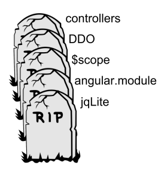
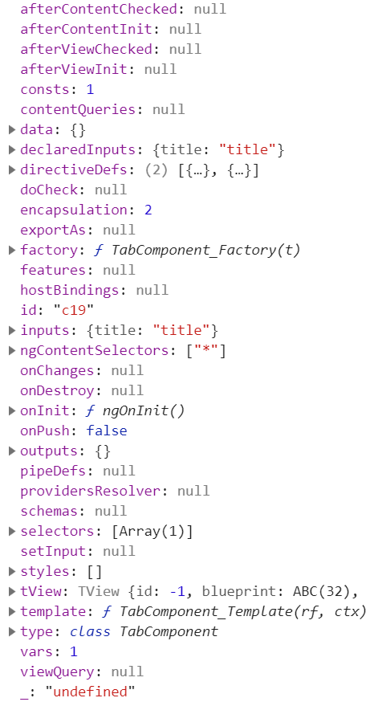
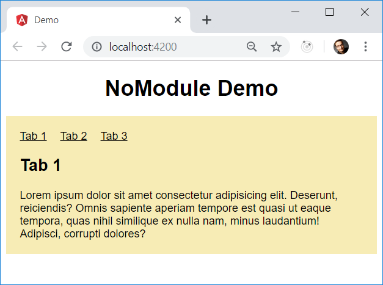

# Architecture with Angular Ivy - Part 1: A possible future without NgModules?

As there is already a module system in EcmaScript, the need for Angular Modules (NgModules) can be confusing. Hence, this is also always a big topic in my [Angular workshops](https://www.softwarearchitekt.at/schulungen/angular). Fortunately, for Angular Ivy NgModules are optional - at least beyond the covers. 

In this post I want to show:

- 🔭 How a possible future without (with optional) NgModules could look like
- 🐹 How we can prepare for this future already today

The [source code](TODO!) used for the examples can be found [here](TODO!).

## A little history

When Angular -- back than called Angular 2 -- was envisioned, the team didn't plan to implement an own module system. While this was necessary in the times of AngularJS 1.x, the idea for Angular (2+) was to just leverage EcmaScript modules introduced in 2015. 

And so, Angular Modules have been among several AngularJS 1.x aspects that should have been skipped in the upcoming version of Google's SPA flagship. The following graphic, taken out of [Igor Minar](https://twitter.com/igorminar?lang=de)'s and [Tobias Bosch](https://twitter.com/tbosch1009?lang=de)'s presentation at ngEurope 2014 in Paris emphasizes this:



However, during the development of Angular it became obvious, that Angular Modules can come in handy for several reasons. One reason was lazy loading; another reason was the need to provide context for the Angular compiler. This is because the compiler needs to know which components, directives, and pipes are available within a template.

On the contrary, Ivy has a different strategy to define the compilation context -- at least under the covers. The next section gives some details about this.

## Compilation Context for Ivy

One of the benefits of Ivy is that it produces simpler code. During compilation, it just adds a static ``ngComponentDef`` property to components. This property contains a definition object describing the component for the compiler. 

Similarly, the compiler adds also such a definition to directives and pipes. They are called ``ngDirectiveDef`` and ``ngPipeDef``.

You can even access it at runtime:

```typeScript
const def: ComponentDef<AppComponent> = AppComponent['ngComponentDef'];
console.debug('def', def);
```

The respective console output would look like this:



As you see here, these properties contain everything Angular needs to know when executing the component. Perhaps you've noticed the ``directiveDefs`` and ``pipeDefs`` properties. They contain the compilation context for the template we've talked about above. 

The first one points to an array of definitions for directives and components. Saying this, a component definition is just a special kind of a directive definition. Alternatively, ``directiveDefs`` can point to a factory function returning such an array. 

The ``pipeDefs`` property does the same for pipe definitions.

This way, Angular knows which (sub-)components, directives, and pipes are available in a component's template.

Now, you might wonder how those properties are filled with the right values. In order to prevent breaking changes, the Ivy compiler just looks up the necessary entries in the component's module as well as in all other modules imported there. After this, it adds the found components, directives, and pipes to ``directiveDefs`` or ``pipeDefs``.

However, if we wanted to use Ivy without modules, we could directly populate these two property. The next section provides some information about this idea.

## Compilation Context without NgModules

Technically, it's possible to directly add the compilation context to ``directiveDefs`` and ``pipeDefs``. Unfortunately, these properties are not part of Angular's public API currently. 

This is for a reason: First of all, the Angular team concentrates on making sure Ivy is completely backwards compatible. Only than, they will introduce new features based upon Ivy step by step. 

When that happens, the ``Component`` decorator might get some additional properties for this reason.

As the next section shows, we can already have a short look into this possible future today. 

## Directly providing the compilation context

As directly providing the compilation context is not possible with public APIs today, this section directly leverages the available private ones. Of course, they can change and hence the techniques outlined here are **not feasible for production** code. 

Nethertheless, this experiment shows how modern Angular code might look like in the future. It also leads to a conclusion that tells us, how we can prepare for this future. 

To demonstrate how to directly provide the compilation context, I'm using a simple example here. It just contains a ``tabbed-pane`` which displays one of several ``tab``s at a time:



The example's ``AppComponent`` uses them:

```html
<tabbed-pane>
  <tab title="Tab 1">
    Lorem ipsum ...
  </tab>
  <tab title="Tab 2">
    Lorem ipsum ...
  </tab>
  <tab title="Tab 3">
    Lorem ipsum ...
  </tab>
</tabbed-pane>
```

For showing and hiding the tabs, the ``TabbedPaneComponent`` uses Angular's ``*ngIf`` directive and for displaying the link it uses ``*ngFor``.

If we want to provide the compilation context directly to these components, we need to get hold of the respective definition objects. For this, I've created a helper function:

```typescript
import { Type } from "@angular/core";
import { ɵComponentDef as ComponentDef } from '@angular/core';

[...]

export function getComponentDef<T>(t: Type<T>): ComponentDef<T> {
  if (t['ngComponentDef']) {
    return t['ngComponentDef'] as ComponentDef<T>;
  }

  throw new Error('No Angular definition found for ' + t.name);
}
```

As you might have noticed, the ``ComponentDef`` class is prefixed with the ``ɵ`` sign. This denotes that the class is still part of Angular's private API.

I've written similar helper functions for getting ``DirectiveDef``s and ``PipeDef``s:

```typescript
export function getDirectiveDef<T>(t: Type<T>): DirectiveDef<T> {
 
    if (t['ngDirectiveDef']) {
      return t['ngDirectiveDef'] as DirectiveDef<T>;
    }

    // A Component(Def) is also a Directive(Def)
    if (t['ngComponentDef']) {
      return t['ngComponentDef'] as ComponentDef<T>;
    }

    throw new Error('No Angular definition found for ' + t.name);
}

export function getPipeDef<T>(t: Type<T>): PipeDef<T> {
 
  if (t['ngPipeDef']) {
    return t['ngPipeDef'] as PipeDef<T>;
  }

  throw new Error('No Angular definition found for ' + t.name);
}
```

Similarly, I've written helper functions for getting all the definition objects from an array of directives and an array of pipes:

```typescript
export function getDirectiveDefs(types: Type<any>[]): DirectiveDef<any>[] {
  return types.map(t => getDirectiveDef(t));
}

export function getPipeDefs(types: Type<any>[]): PipeDef<any>[] {
  return types.map(t => getPipeDef(t));
}
```

Please note that the former one is also respecting component definitions, as a component definition is a special kind of a directive definition. Technically, ``ComponentDef`` even inherits ``DirectiveDef``.

Using these helpers, we can easily add the compilation context to our components:

```typescript
@Component({ [...] })
export class AppComponent {
  title = 'demo';
}

// Adding compilation context
const def = getComponentDef(AppComponent);

def.directiveDefs = [
  getDirectiveDef(TabComponent), 
  getDirectiveDef(TabbedPaneComponent)
];
```

For the sake of simplicity, I'm overwriting the ``directiveDefs`` property here. This means that values the compiler placed there after traversing possibly existing modules are overwritten too.

Of course, adding the same definition objects time and again to different consuming objects is annoying. However, we could group components belonging together using a central array:

```typescript
export const TABBEND_PANE_COMPONENTS = [
    TabbedPaneComponent,
    TabComponent
];
```

To import this array, we can use our ``getDirectiveDef`` helper function:

```typescript
def.directiveDefs = [
  ...getDirectiveDefs(TABBEND_PANE_COMPONENTS)
];
```

Similarly to this, I've written a file exporting all the directives I need from ``@angular/common``:

```typescript
export const COMMON_DIRECTIVES = [
    NgIf,
    NgForOf,
    // etc.
];
```

This one is used for the ``TabbedPaneComponent``:

```typescript
@Component({ [...] })
export class TabbedPaneComponent implements AfterContentInit {
    [...]
}

const def = getDef(TabbedPaneComponent);

def.directiveDefs = [
     ...getDefs(COMMON_DIRECTIVES)
];
```

Of course, as we have just two components, this is not a big win here but in bigger scenarios with lots of components using such an array comes quite in handy. 

As patching a component after defining it is somewhat brutal, the next section shows a better way.

## Providing the compilation context with a decorator

To add the compilation context to components in a way we are more used to as Angular developers, I've written a simple decorator:

```typescript
export interface ComponentDepsConfig {
  directives?: Type<any>[];
  pipes?: Type<any>[];
}

export function ComponentDeps(config: ComponentDepsConfig) {
  return (component) => {

    const def = getComponentDef(component);

    def.directiveDefs = [
      ...getDirectiveDefs(config.directives || [])
    ];

    def.pipeDefs = [
      ...getPipeDefs(config.pipes || [])
    ];

  }
}
```

To be more precise, this is a factory for a decorator. It takes a config object containing the compilation context and returns a decorator for a component. This decorator adds the context to the component's definition.

Now, let's apply this decorator to our components:

```typescript
@Component({ [...] })
@ComponentDeps({
  directives: [ 
    ...TABBEND_PANE_COMPONENTS
  ]
})
export class AppComponent {
  title = 'demo';
}
```

This looks a lot like the envisioned possible future where the component decorator directly takes the compilation context.

However, now the question is what can we learn from this experimental case study. The next section provides an answer.

## Preparing for a possible future without (with optional) NgModules

In this article, we've seen that we need a compilation context. If we don't have something like ``NgModules`` we could assign it directly to our components. This is already possible by using internal APIs and the respective properties might eventually be exposed a part of Angular's public API.

We've also seen that even in this case, it's in handy to group components, directives, or pipes belonging together. For this reason we've used a simple array:

```typescript
export const TABBEND_PANE_COMPONENTS = [
    TabbedPaneComponent,
    TabComponent
];
```

Interestingly, this array look like the ``export`` part of an NgModule. However, this is pure EcmaScript which makes its simpler and easier to understand.

Also, it's obvious that even in a future without ``NgModules`` we need a way to group parts of our code. We will also need some way of information hiding which means we have to define public and private parts of our APIs. Fortunately, this can also be accomplished with pure EcmaScript by using barrels.

For instance, in my case study, the ``tabbed-pane`` folder has the following ``index.ts``:

```typescript
export * from './tab.component';
export * from './tabbed-pane.component';

// array with components
export * from './components'; 
```

The ``app.component.ts`` imports this barrel:

```typescript
import { TABBEND_PANE_COMPONENTS } from './tabbed-pane';
```

We can even go one step further and use a monorepo with different libraries. Each library gets a barrel which defines the public API. Thanks to the Angular CLI creating libraries to group your code is very easy. It's just a matter of one command (``ng generate lib my-lib``) and it also makes your code more reusable. 

Furthermore, when using [Nrwl's Nx](https://nx.dev) for creating an Angular CLI based monorepo, you can also [define access restrictions between your libraries](https://www.softwarearchitekt.at/post/2019/03/04/sustainable-angular-architectures-with-strategic-design-and-monorepos-part-2-implementation.aspx). Also, it contains linting rules preventing that someone uses private parts of your APIs by bypassing their barrels.

This all leads to my advice for preparing for this possible future without (with optional) Angular modules:

1. Cut your application into libraries and use barrels to define their public APIs.
2. When NgModules become optional, replace them with an their ``export`` arrays.

Finally, let me tell you the best: Regardless, if this possible future will happen or not, this advice makes a lot of sense anyway, because cutting your application into tiny libraries with a public and a private part leads to a more robust architecture.