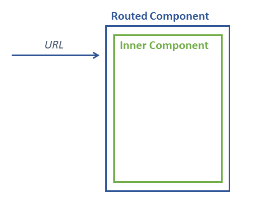

# Architecture with Angular Ivy - Part 2: Higher order and dynamic Components

TLDR; With Ivy's private APIs, we can dynamically create components. The example here demonstrates this by creating a routed component on the fly:

```typescript
const routes: Routes = [
  {
    path: 'comic/:comicId',
    component: withRoute(ComicComponent)
  }
];
```

As an software architect, I'm constantly in search for ways to improve my applications's structures. The goal is nearly always to provide robust and more sustainable solutions. This is also a big topic in my [advanced Enterprise Angular workshop](https://www.softwarearchitekt.at/schulungen/advanced-angular-enterprise-anwendungen-und-architektur/).

Ivy provides some awesome features helping to reach these goals.
In this article series, I show them in the context of several examples. I look behind the curtain of Angular's new view engine which helps us to understand better what's going on and what the future of Angular might look like. 

In this article, I show how to use Ivy to generate components on the fly and how to create a higher order components.

> Big thanks, to Angular's [Alex Rickabaugh](https://github.com/alxhub) for reviewing this article and for giving me some hints about Ivy.

**DISCLAIMER**: The examples here are an **experiment** showing how Ivy works under the covers by leveraging its **private APIs**. Hence, it's not production ready and it *does not* reflect the Angular teams's official vision. Nethertheless, it's useful to learn how Ivy works and what features we might get via the official public APIs after Ivy landed.

Currently, the Angular team's goal is to make sure, there are no breaking changes after migrating to Ivy. After this, they will introduce new features based on Ivy step by step.

## Example

The example I use here is a simple comic browser:


After selecting a comic from the list, the router puts the respective comicId into the URL and activates a ``RoutedComicComponent``:

```typescript
@Component({
  selector: 'app-routed-comic',
  templateUrl: './routed-comic.component.html'
})
export class RoutedComicComponent implements OnInit {

  constructor(private route: ActivatedRoute) { }

  params: any = {};

  ngOnInit() {
    this.route.params.subscribe(params => {
      this.params = params;
    });
  }

}
```

This component reads the parameters from the URL. The template binds them to the ``ComicComponent`` which displays the comic in question:

```html
<app-comic [comicId]="params.comicId"></app-comic>
```

To put it in a nutshell, we have a routed component which just delegates the routing parameters to an inner one, e. g. the ``app-comic``:



## Goal

In our example, the ``RoutedComicComponent`` can be considered glue code. It's just here to read and delegate the parameters. 

Of course, we could put this logic into the ``ComicComponent`` but in this case this component would have to know the router including the current very specific routing configuration. In turn, this component would become less reusable. 

On the other side, the ``RoutedComicComponent`` would look very similar for other components. Only its encapsulated component needed to be exchanged. Hence, we can create this component on the fly for different encapsulated components. 

As the next sections show, this task is quite easy with Ivy.

## Inspecting the result of the Ivy compiler

Before we go on, let's find out how Ivy transforms our ``RoutedComicComponent`` during the compilation. To make the compiled code more readable, we should switch to ES2015 if this is not already the case. For this, make sure the ``target`` property in your ``tsconfig.json`` points to ``ES2015``:

```json
{
  [...]
  "compilerOptions": {
    [...]
    "target": "es2015",
    [...]
  },
  [...]
}
```

Also, make sure you are using Ivy. In this case, we need the following ``angularCompilerOptions`` node in our ``tsconfig.app.json``:

```json
{
  "extends": "./tsconfig.json",
  "compilerOptions": {
    [...]
  },
  "include": [
    [...]
  ],
  "exclude": [
    [...]
  ],
  "angularCompilerOptions": {
    "enableIvy": true
  }
}
```

After running ``ng build --aot`` we should find the downleveled version of our ``RoutedComicComponent`` within the ``main`` bundle in the ``dist`` folder.

```typescript
class RoutedComicComponent {
    constructor(route) {
        this.route = route;
        this.params = {};
    }
    ngOnInit() {
        this.route.params.subscribe(params => {
            this.params = params;
        });
    }
}
```

```typescript
const _c0 = [3, "comicId"];

RoutedComicComponent.ngComponentDef = ɵɵdefineComponent({
    type: RoutedComicComponent, 
    selectors: [["app-routed-comic"]], 
    factory: function RoutedComicComponent_Factory(t) { 
        return new (t || RoutedComicComponent)(ɵɵdirectiveInject(ActivatedRoute)); 
    }, 
    consts: 1, 
    vars: 1, 
    template: function RoutedComicComponent_Template(rf, ctx) {
        if (rf & 1) {
            ɵɵelement(0, "app-comic", _c0);
        } if (rf & 2) {
            ɵɵproperty("comicId", ctx.params.comicId);
        }
    }, 
    directives: [ComicComponent], 
    styles: ["..."]
});
```

As you see here, Ivy adds a static ``ngComponentDef`` property during compilation. It contains all the details, it needs to execute the component at runtime. Most of them are self explaining:

- ``type``: The component's type
- ``selectors``: Each defined selector is an array within this array here. E. g. the selectors ``ul li, div.ul div.li`` would become ``[ ['ul', 'li'], ['div.ul', 'div.li']]``.
- factory: Function creating the component. Please note that it also takes care of injecting the necessary  dependencies. 

  The passed parameter ``t`` is only used for sub-classing. If a component ``MyComp`` inherits ``BaseComp``, ``MyComp``'s factory has to delegate to ``BaseComp``'s one. However, as you want to instantiate ``MyComp`` in this case, ``MyComp`` is passed as the parameter ``t``. This way, ``MyComp`` can also inherit the injections set up for ``BaseComp``.

- ``const``: The count of nodes, local refs, and pipes in the template. This is used to initial an internal array with a proper length.
- ``vars``: The same for the number of bindings.
- ``template``: The compiled version of our HTML template.
- ``directives``: Other directives and components our component can call. Ivy populates this array with entries from NgModules to be backwards competable. However, [as shown in my former post](TODO!), this clearly shows that Ivy -- at least it's private APIs -- doesn't need ``NgModules`` anymore. 
- ``styles``: CSS rules

Also note, that the used functions are prefixed with ``ɵɵ`` which shows that we are talking about Ivy's internal and hence not public API. Hence, details can change over time.

Now, let's have a closer look to the template function. It's really nothing more than a JavaScript representation of our template. Instead of exchanging placeholders within HTML (or SVG, etc.) time and again, Angular uses this function in order to improve the data binding and rendering performance.

The passed parameter, ``rf`` (``RenderFlags``), denotes the rendering phase. Angular sets the first bit when it creates the component and the second bit when it updates the bindings. Hence, in the former case, the function creates the template's elements while in the latter one, it updates their bindings. 

The second parameter, ``ctx`` (``Context``), points to the component's instance.

For creating an element, ``ɵɵelement`` takes an unique id used later to reference the element and the element's name. In our case, this name points to the component with the selector ``app-comic``. The last parameter, _c0, informs ɵɵelement about attributes, properties, etc. The ``3`` in this array indicates that the next entry is a property we bind to and the following ``comicId`` is its name.

For updating this binding, ``ɵɵproperty`` takes its name and its new value. Perhaps you are wondering, how ``ɵɵproperty`` knows which element we are referring to. In our case, it's easy as there is only one element. 

By default, ``ɵɵproperty`` uses the element with the internal id 0. To switch over to another one, Ivy calls ``ɵɵselect`` with the respective element id. For instance, to work on the element with the internal id 2, we would use the following code:

```typescript
ɵɵselect(2);
ɵɵproperty("comicId", ctx.params.comicId);
```

As we have now the necessary knowledge about Ivy's internals, we case build upon it to dynamically create components like out ``RoutedComicComponent``.

## Creating a higher order component/ dynamic component

To dynamically create an Ivy component, we just need a factory function which takes parameters and returns the component. In our case, the only parameter is the Angular component we want to route to. To be more precise, it's its type, e. g. ``ComicComponent``. 

The return value is a dynamic routed component which renders the passed component and delegates all received routing parameters. This make this routed component a higher order component as it is a component parameterized with another one.

Let's say, the factory function is called ``withRoute``. In this case we can use it as follows within our routing configuration:

```typescript
const routes: Routes = [
  {
    path: 'comic/:comicId',
    component: withRoute(ComicComponent)
  }
];
```

Because of this, we don't need to handwrite a ``RoutedComicComponent`` anymore.

The basic structure of ``withRoute`` looks like this:

```typescript
export function withRoute(inner: Type<any>) {

    // Step 1: Create a class on the fly
    class HigherOrderComponent implements OnInit {
      [...]
    }

    // Step 2: Assign ngComponentDef
    HigherOrderComponent.ngComponentDef = ɵɵdefineComponent({
      [...],
      template: function(rf, ctx) { 
        // Step 2a: Call the inner component
        [...] 
      }
    });

    // Step 3: Return component
    return HigherOrderComponent;
}
```

Also, at the beginning of this function, we need to get the selector of the passed component so that it can be rendered dynamically later:

```typescript
// At runtime component will be a ɵComponentType<any> with
// a static ngComponentDef property
const ngComponent = inner as ɵComponentType<any>;

// Step 1: Get needed information from ngComponentDef
const def = ngComponent.ngComponentDef as ɵComponentDef<any>;

// Simplification: We assume a single element name
const elementName = def.selectors[0][0] as string;
```

The class declared within the function looks like this:

```typescript
class HigherOrderComponent implements OnInit {

    static ngComponentDef: ɵComponentDef<HigherOrderComponent>;

    params: any = {};

    constructor(private route: ActivatedRoute) {
    }

    ngOnInit() {
        this.route.params.subscribe(params => {
          this.params = params;
        });
    }
}
```

As you see here, this method only puts the received routing parameters in the property ``params``.

Please note that each call of the function declares a new class. Technically, you have a local variable ``HigherOrderComponent`` pointing to a dynamically created class.

The assigned ``ngComponentDef`` contains the same information as we've found in the bundle described above:

```typescript
HigherOrderComponent.ngComponentDef = ɵɵdefineComponent({
    consts: 1,
    vars: 1,
    directives: [
        component
    ],
    changeDetection: ChangeDetectionStrategy.Default,
    factory: () => new HigherOrderComponent(
        ɵɵdirectiveInject(ActivatedRoute)),
    selectors: [[]],
    template: (rf, ctx) => {
        [...]
    },
    type: HigherOrderComponent,
});
```

To give this component the possibility to render the passed component, the latter one is put into the directives array. However, the real interesting part here is the template function which binds the routing parameters:

```typescript
template: (rf, ctx) => {

    if (rf & ɵRenderFlags.Create) {
        ɵɵelement(0, elementName);
    }
    if (rf & ɵRenderFlags.Update) {
        for (const prop in ctx.params) {
            const compProp = def.inputs[prop];
            if (compProp) {
                ɵɵproperty(prop, ctx.params[compProp]);
            }
        }
    }
},
```

Instead of hardcoding the render flags this function uses the ``ɵRenderFlags`` enumeration. During the creation phase, it creates an element for the passed component. 

During the the update phase, the template function iterates through all received routing parameters and checks if the passed component has inputs with the same name. For this, it looks into the ``inputs`` map of it's ``ngComponentDef``. 

If there is a match, the respective property can be found within this map. In Angular it's usual that inputs have the same name as the respective properties. In this case the ``inputs`` map looks like this:

  ```json
  {
    "comicId": "comicId"
  }
  ```

However, the ``Input`` decorator gives us the possibility to assign a different name to the inputs using a parameter:

```typescript
  @Input('cid') comicId: string;
```

In this case, the ``input`` property would map ``cid`` to comicId:

```json
{
  "cid": "comicId"
}
```

That shows, we are on the safe side when looking the property up in this map.

After finding a match, the template function updates the respective property using ``ɵɵproperty``.

## Conclusion

Ivy allows us to dynamically create components on the fly and hence to create higher order components. For this, we just need a class with a proper ``ngComponentDef`` property. 

To find out how such a ``ngComponentDef`` needs to be structured, we can AOT-compile an example and examine the resulting bundles.

While this is really straight forward, please keep in mind that we need to leverage Ivy's private APIs for this. However, enabling such things was a design goal for Ivy and sooner or later the Angular team will (hopefully) add these possibilities to the public one.

## Bonus: Compiling at runtime (if performance and bundle size is not a topic)

**If performance and bundle sizes do not matter** and **if you are not able to feel any pain at all**, you can also use the Angular compiler at runtime:

For this, you have to import the compiler somewhere in your application, e. g. when bootstrapping:

```typescript
import '@angular/compiler';
```

Then, create your component class on the fly, e. g. within an factory function:

```typescript
@Component({ template: '' }) 
class HigherOrderComponent { [...] }
```

Please note, that this Decorator is not used at all. However, we need to use an arbitrary decorator to make TypeScript emit the necessary metadata for dependency.

To get an ``ngComponentDef``, call the compiler:

```typescript
ɵcompileComponent(HigherOrderComponent, { template: '<b>Hello</b>' });
```

The second parameter takes the traditional options normally passed to @Component. Obviously, you can create this object dynamically.